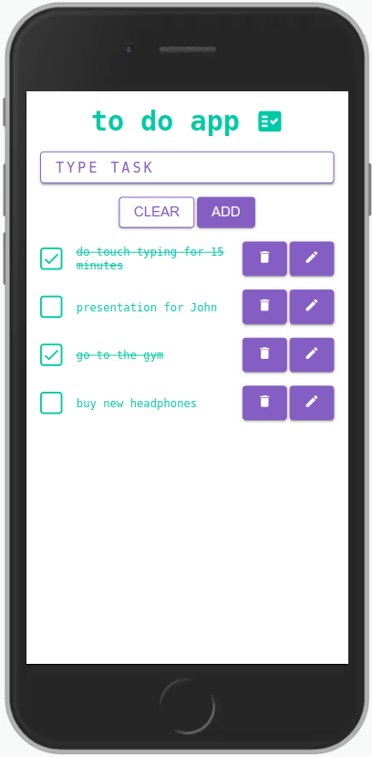

# to-do-app

Simple to-do-app created with **React.js**, **TypeScript** and **Styled Components**.

**Live demo**: _https://plewko.github.io/todoapp_



## Table of contents

- [General info](#general-info)
- [Features](#features)
- [Technologies](#technologies)
- [Setup](#setup)

## General info

This project is a simple to do app made for practise.

## Features

User can:

- add task
- mark task as done or undone
- edit task
- delete task

## Technologies

Project is created with:

- React.js
- TypeScript
- Styled Components

## Setup

To run this project, install it locally using npm:

```
$ npm install
$ npm start
```
